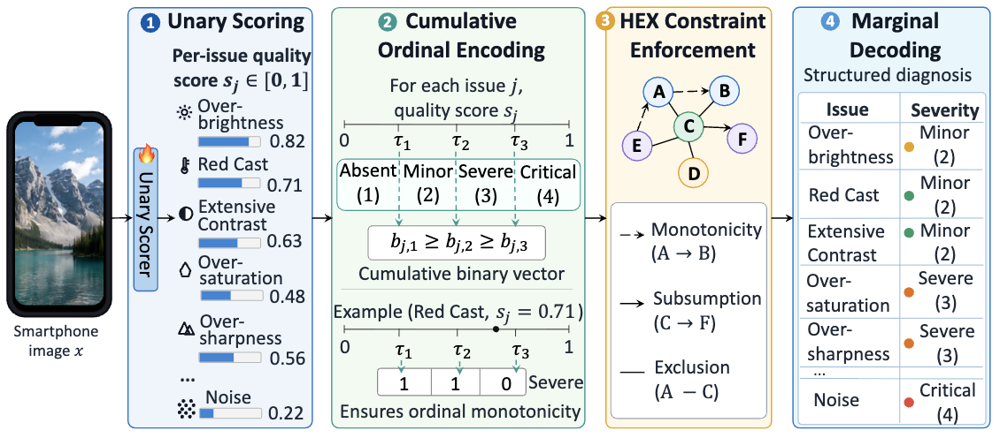

# PrISM-IQA: Image Quality Assessment Made Practical for Smartphone Photography

This is the official PyTorch implementation of **PrISM-IQA**, a practical ISP-aware structured model for smartphone photography quality assessment.

<p align="center">
  <b>Shuyan Zhai</b> · <b>Jiaqi He</b> · <b>Weixia Zhang</b> · <b>Liang Wang</b> · <b>Zhenjie Lee</b> · <b>Zufeng Zhang</b> · <b>Kede Ma</b>
</p>


<p align="center">
  <a href="https://github.com/Multimedia-Analytics-Laboratory/PrISM-IQA"></a>
  
  
  
  
</p>


<p align="center">
  
</p>


> PrISM-IQA reformulates smartphone IQA as multi-issue ordinal diagnosis: each image is assessed over ISP-relevant quality issues with four severity levels, structured constraints, and partial-label learning.

## Highlights

- **Practical smartphone IQA diagnosis.** PrISM-IQA predicts issue-level severity across ISP-relevant artifacts, moving beyond a single global quality score.
- **Structured ordinal reasoning.** Cumulative ordinal encoding and HEX-constrained inference produce consistent four-level diagnoses: absent, minor, severe, and critical.

## News

- Initial code release: core PrISM-IQA training, HEX inference, split generation, and evaluation scripts are included.

## Repository Structure

```text
.
├── assets/
│   └── framework.png
├── ImageDataset.py          # image patch dataset and partial-label mask handling
├── coop.py                  # CLIP + CoOp unary scorer with learnable ordinal thresholds
├── generate_cv_splits.py    # train/val/test split generation
├── label_schema.py          # issue taxonomy, evaluation labels, and HEX relations
├── legal_states.py          # legal HEX state enumeration and component factorization
├── metrics_utils.py         # ACC, threshold AUC, QWK, and macro recall helper
├── my_loss.py               # HEX-CRF marginal likelihood loss
├── train.py                 # main training and evaluation entry point
├── utils.py                 # dataloading, transforms, and checkpoint utilities
└── requirements.txt
```

This clean release intentionally excludes paper PDFs, linear probing scripts, cached bytecode, checkpoints, logs, and experiment outputs.

## Installation

```bash
conda create -n prism_iqa python=3.10
conda activate prism_iqa

pip install -r requirements.txt
```

The code uses OpenAI CLIP. If your environment already provides `clip`, you can skip reinstalling it.

## Data Preparation

The label CSV should contain one `image` column followed by the PrISM-IQA issue columns defined in `label_schema.py`.

```csv
image,too bright,too dark,contrast too high,contrast too low,...
000001.jpg,0,1,0,2,...
```

Label convention:

- `0`: absent
- `1`: minor
- `2`: severe
- `3`: critical

The paper reconstructs SPAQ with dense annotations for 11,125 images and 53 quality issues. Local issue labels are applicable only when the corresponding semantic region exists. Following the paper setup, 19 issues with fewer than 100 images are treated as unobserved during training and excluded from quantitative evaluation, leaving 34 evaluation labels.

Generate a 7:1:2 split:

```bash
python generate_cv_splits.py \
  --master-csv /path/to/merged_labels_renamed.csv \
  --output-root csv_file_merged \
  --num-splits 1
```

The command creates:

```text
csv_file_merged/split0/train.csv
csv_file_merged/split0/val.csv
csv_file_merged/split0/test.csv
```

## Training

```bash
python train.py \
  --split split0 \
  --csv-root csv_file_merged \
  --image-path /path/to/SPAQ_dataset/TestImage \
  --output-root output
```

Default training setup follows the paper configuration:

- visual backbone: `CLIP ViT-L/14`
- CoOp context length: `M=4`
- effective batch size: `50`
- epochs: `50`
- crops: `5` for training and `9` for validation/testing
- crop size: `224 x 224`
- optimizer: AdamW with weight decay `1e-3`
- learning rates: `5e-6` for the visual backbone and `5e-4` for prompt/threshold parameters
- scheduler: cosine annealing

The default script evaluates the 34 labels in `EVAL_LABELS_MIN100_GLOBAL`. Other labels are masked as unobserved by default.

## Evaluation

During training, the script evaluates validation and test splits after every epoch. The best checkpoint is selected by validation threshold AUC.

Outputs are written to:

```text
output/
├── ckpt/split0/
└── results/split0/
```

`best_epoch_metrics.csv` contains:

- `acc`: exact severity accuracy
- `auc`: threshold AUC averaged over the three ordered decision boundaries
- `qwk`: quadratic weighted kappa
- `recall`: macro recall helper for additional diagnosis

The paper reports ACC, tAUC, and QWK as the main metrics. The `auc` column in this release corresponds to paper tAUC.

## Model Components

PrISM-IQA contains three main pieces:

1. **Vision-language unary scorer.** CLIP image features are compared with CoOp-learned issue prompts to obtain one latent severity score per issue.
2. **Cumulative ordinal thresholding.** Each issue score is converted into three binary threshold events.
3. **HEX-CRF inference.** Legal states enforce monotonicity, mutual exclusion, and subsumption before marginal decoding.

The issue taxonomy and graph constraints are defined in `label_schema.py`. Legal states are compiled in `legal_states.py`.

## Scope of This Release

This repository is intended as a clean implementation of the main PrISM-IQA training and evaluation pipeline. Linear probing and downstream ISP tuning experiments discussed in the paper are not included in this lightweight release.

## Citation

If this repository is useful for your work, please cite:

```bibtex
@misc{zhai2026prismiqa,
  title  = {PrISM-IQA: Image Quality Assessment Made Practical for Smartphone Photography},
  author = {Zhai, Shuyan and He, Jiaqi and Zhang, Weixia and Wang, Liang and Lee, Zhenjie and Zhang, Zufeng and Ma, Kede},
  year   = {2026},
  note   = {Preprint}
}
```

## Acknowledgement

This implementation builds on CLIP and CoOp-style prompt learning. We also thank the open-source IQA and vision-language communities.
